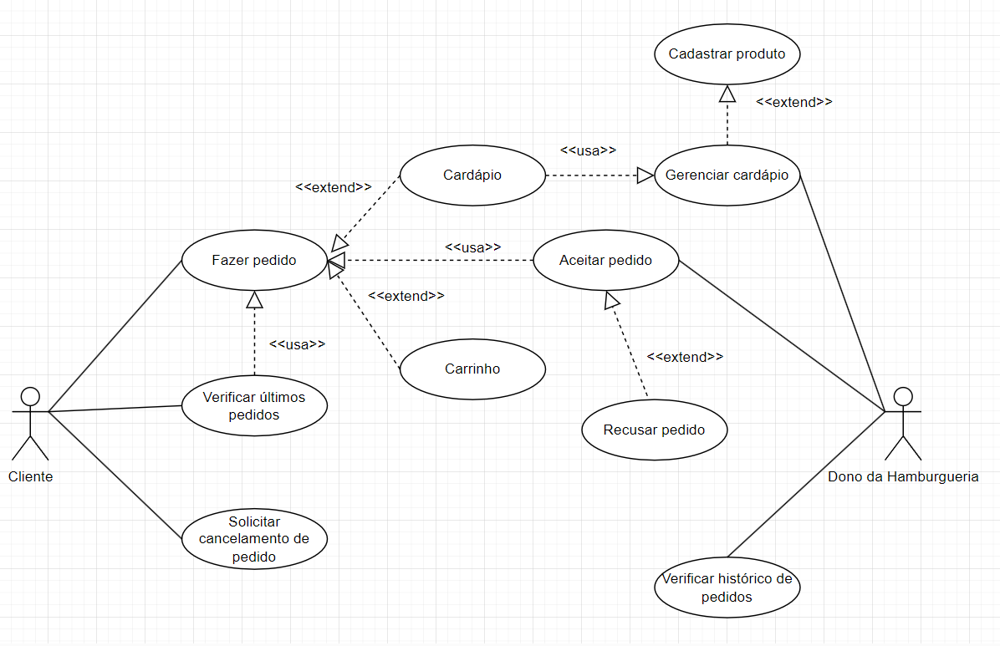

# Especificações do Projeto

A escolha do referido problema foi definida por meio de discussões e estudos realizados pelos membros da equipe e a gestão da hamburgueria. Os detalhes levantados nesse processo foram consolidados na forma de personas e histórias de clientes.

## Personas

### 1999 burguer:

### Clientes da 1999 Burguer:

## Histórias de Usuários

Com base na análise das personas forma identificadas as seguintes histórias de usuários:

| EU COMO... | QUERO/PRECISO ...                                                     | PARA ...                                              |
| ---------- | --------------------------------------------------------------------- | ----------------------------------------------------- |
| Pedro      | Preciso de uma plataforma onde consigo fazer os controles dos pedidos | Aumentar meu faturamento e crescer meu negócio.      |
| Ana        | Preciso de uma plataforma que facilite os pedidos de lanches          | para melhorar as sextas do lanche que realizo         |
| João      | Preciso de um aplicativo que não demore para fazer pedidos           | para não atraplhar as noites de jogatina com os meus |
| Geneci     | Quero um aplicativo que seja fácil de mexer                          | Pedir lanches durante os jogos                        |

## Modelagem do Processo de Negócio

### Análise da Situação Atual

A falta da centralização de pedidos em um sistema e a dificuldade da realização destes pelos consumidores tem se tornado cada vez mais um desafio das empresas de delivery, fazendo com que elas possam perder vendas e consequentemente clientes.

### Descrição Geral da Proposta

Nossa plataforma auxiliará a hamburgueria no gerenciamento dos pedidos, bem como ter contato mais direto com o consumidor final. O consumidor final terá a comodidade e praticidade em realizar os pedidos em uma plataforma mobile acessível e intuitiva.

#### Processo 1 - Cadastro Consumidor Final - Mobile

#### Processo 2 - Cardápio - Mobile

#### Processo 3 - Carrinho - Mobile

#### Processo 4 - Home Page - Mobile

#### Processo 5 - Cadastro Usuário - Aplicação Web

#### Processo 6 - Produtos - Aplicação Web

#### Processo 7 - Lista Pedidos - Aplicação Web

#### Processo 8 - Detalhes Pedido - Aplicação Web

#### Processo 9 - Histórico de Pedidos - Aplicação Web

## Indicadores de Desempenho

| # |Indicador|Objetivos|Descrição|Cálculo|Fonte de Dados|Perspectiva|
|--|--|--|--|--|--|--|
| 1 | Número de downloads | Aumentar o número de usuários | Contabiliza o número de downloads realizados do aplicativo | Total de downloads | Plataformas de distribuição de aplicativos (App Store, Google Play) | Crescimento do Produto
|2| Taxa de conversão | Aumentar o número de usuários ativos | Mostra a porcentagem de usuários que fizeram o download do aplicativo e se tornaram usuários ativos | Usuários ativos / número de downloads * 100 | Sistema do Aplicativo | Financeira |
|3| Compras de Clientes | Aumentar a fidelidade dos usuários | Mede o número de pedidos do usuário | Quantidades de pedido | Sistema do aplicativo | Financeira |
|4| Avaliação do usuário | Melhorar a satisfação do usuário | Mede a satisfação do usuário em relação ao aplicativo | Média das avaliações dos usuários | Plataformas de distribuição de aplicativos (App Store, Google Play) | Cliente |
|5| Taxa de churn | Reduzir a perda de usuários | Mostra a porcentagem de usuários que deixaram de usar o aplicativo | Número de usuários perdidos / número de usuários ativos * 100 | Sistema do aplicativo | Monitorar a aceitação do público |
|6| Retorno sobre investimento | Obter lucro com o aplicativo | Mede o retorno financeiro sobre o investimento realizado no aplicativo | (Receita gerada - Custo do desenvolvimento) / Custo do desenvolvimento * 100 | Sistema financeiro do negócio | Financeira |

## Requisitos

As tabelas que se seguem apresentam os requisitos funcionais e não funcionais que detalham o escopo do projeto. Para determinar a prioridade de requisitos, aplicar uma técnica de priorização de requisitos e detalhar como a técnica foi aplicada.

### Requisitos Funcionais

#### Requisitos Funcionais Aplicação WEB

| ID     | Descrição do Requisito                                                                                                                                                                          | Prioridade |
| ------ | ------------------------------------------------------------------------------------------------------------------------------------------------------------------------------------------------- | ---------- |
| RF-001 | O sistema deverá conter uma tela de login para que o dono do estabelecimento realize o acesso ao sistema                                                                                         | ALTA       |
| RF-002 | O sistema deverá ter uma home na qual o usuário terá acesso a uma tela de pedidos e um menu de navegação para outras páginas                                                                | ALTA       |
| RF-003 | O menu deverá permitir o usuário navegar entre as seguintes telas: pedidos, gerenciar cardápio, histórico de pedidos, meu perfil                                                              | ALTA       |
| RF-004 | A tela de pedidos será composta por uma listagem de pedidos feitos pelo APP organizados em blocos e com informações como ticket do pedido, lanche, valor                                       | ALTA       |
| RF-005 | A tela de pedidos terá os botões 'pendente' e 'em andamento', cada um deles exibirá os pedidos com seu respectivo status                                                                       | ALTA       |
| RF-006 | Os blocos de pedidos em andamento terão um botão de concluído, para enviar o pedido ao histórico e ao cliente                                                                                 | ALTA       |
| RF-007 | A tela de gerenciar cardápio deverá exibir o cardápio da loja em lista                                                                                                                         | ALTA       |
| RF-008 | Na tela de gerenciar cardápio é necessário haver um botão de acrescentar novo item, encaminhando para uma página de cadastro.                                                                | ALTA       |
| RF-009 | A página de cadastro deve permitir criar um produto com nome, imagem, descrição e preço. Deve haver um botão de públicar o ítem                                                            | ALTA       |
| RF-010 | O item gerado deverá conter as opções de: editar, excluir e disponibilizar                                                                                                                     | ALTA       |
| RF-011 | A tela de histórico de pedidos deverá exibir uma lista em blocos com o nome do cliente, endereço, telefone, ticket do pedido, o que pediu e valor da compra, status concluido e data do pedido | ALTA       |
| RF-012 | Deve ser possível inciar o pedido ou cancelar na própria tela de pedidos pendentes na home                                                                                                      | ALTA       |
| RF-013 | O usuário deverá conseguir editar seus dados no sistema                                                                                                                                         | ALTA       |
| RF-014 | Ao clicar em editar, o sistema deverá permitir que o usuário altere as informações desejadas no produto                                                                                       | ALTA       |

#### Requisitos Funcionais API

| ID     | Descrição do Requisito                                                                            | Prioridade |
| ------ | --------------------------------------------------------------------------------------------------- | ---------- |
| RF-015 | A API deverá fornecer um endpoint GET para retornar todos os produtos cadastrados                  | ALTA       |
| RF-016 | A API deverá fornecer um endpoint GET para retornar dados de um único produto                     | ALTA       |
| RF-017 | A API deverá fornecer um endpoint POST para criar um novo produto                                  | ALTA       |
| RF-018 | A API deverá fornecer um endpoint PUT para atualizar o produto                                     | ALTA       |
| RF-019 | A API deverá fornecer um endpoint DELETE para excluir um produto                                   | ALTA       |
| RF-020 | A API deverá fornecer um endpoint GET para retornar todos os pedidos cadastrados                   | ALTA       |
| RF-021 | A API deverá fornecer um endpoint GET para retornar detalhes de um pedido                          | ALTA       |
| RF-022 | A API deverá fornecer um endpoint POST para criar um novo pedido                                   | ALTA       |
| RF-023 | A API deverá fornecer um endpoint GET para retornar todos os produtos com status iguais            | ALTA       |
| RF-024 | A API deverá fornecer um endpoint PUT para alterar o status do pedido                             | ALTA       |
| RF-025 | A API deverá fornecer um endpoint GET para retornar dados do usuário                              | ALTA       |
| RF-026 | A API deverá fornecer um endpoint PUT para atualizar dados do usuário                             | ALTA       |
| RF-027 | A API deverá fornecer um endpoint POST para inserir os dados básicos para realização do pedido | ALTA       |
| RF-028 | A API deverá fornecer um endpoint DELETE para excluir o registro da pessoa                        | ALTA       |
| RF-029 | A API deverá fornecer um endpoint POST para autenticar o login do usuário                        | ALTA       |
| RF-030 | A API deverá fornecer um endpoint POST para cadastrar um usuário no banco                        | ALTA       |

#### Requisitos Funcionais Aplicação Mobile

| ID     | Descrição do Requisito         | Prioridade |
| ------ | ------------------------------ | ---------- |
| RF-031 | A aplicação mobile deverá possuir uma tela de login, colhendo: e-mail e senha | ALTA |
| RF-032 | A aplicação mobile deverá possuir uma tela de cadastro, colhendo: nome, e-mail, senha, endereço de entrega | ALTA |
| RF-033 | A aplicação mobile deverá possuir uma tela de cardápio, possibilidando a visualização dos produtos | ALTA |
| RF-034 | Na tela do cardápio, permitir adicionar produtos ao carrinho | ALTA |
| RF-035 | A aplicação mobile deverá possuir uma tela de carrinho, listando os produtos escolhidos | ALTA |
| RF-036 | Na tela de carrinho, permitir a manuteção dos produtos escolhidos, o que inclui: exclusão do produto, aumentar quantidade do produto e diminuir quantidade do produto | ALTA |
| RF-037 | Na tela do carrinho, permitir finalizar o pedido | ALTA |
| RF-038 | A aplicação mobile deverá possuir uma tela de acompanhamento do pedido | MÉDIA |
| RF-039 | A aplicação mobile deverá possuir uma tela para manuteção do cadastro do usuário | MÉDIA |

### Requisitos Não Funcionais Web

| ID      | Descrição do Requisito         | Prioridade |
| ------- | -------------------------------- | ---------- |
| RNF-001 | O sistema irá criptografar a senha do usuário | ALTA       |
| RNF-002 | A aplicação web deve ser compatível com os principais navegadores da web, como Chrome, Firefox, Safari e Edge. | MÉDIA     |
| RNF-003 | A interface da aplicação web deve ser responsiva, adaptando-se automaticamente a diferentes tamanhos de tela | ALTA       |
| RNF-004 | A tela de pedidos será composta por uma lista de pedidos organizados em blocos com as informações dos pedidos | MÉDIA     |

## Restrições

O projeto está restrito pelos itens apresentados na tabela a seguir.

| ID | Restrição                                             |
| -- | ------------------------------------------------------- |
| 01 | O projeto deverá ser entregue até o final do semestre |
| 02 | Não pode ser desenvolvido um módulo de backend        |

Enumere as restrições à sua solução. Lembre-se de que as restrições geralmente limitam a solução candidata.

## Diagrama de Casos de Uso

# Matriz de Rastreabilidade Web

> **Links Úteis**:
>
> - [Artigo Engenharia de Software 13 - Rastreabilidade](https://www.devmedia.com.br/artigo-engenharia-de-software-13-rastreabilidade/12822/)
> - [Verificação da rastreabilidade de requisitos usando a integração do IBM Rational RequisitePro e do IBM ClearQuest Test Manager](https://developer.ibm.com/br/tutorials/requirementstraceabilityverificationusingrrpandcctm/)
> - [IBM Engineering Lifecycle Optimization – Publishing](https://www.ibm.com/br-pt/products/engineering-lifecycle-optimization/publishing/)

# Gerenciamento de Projeto

De acordo com o PMBoK v6 as dez áreas que constituem os pilares para gerenciar projetos, e que caracterizam a multidisciplinaridade envolvida, são: Integração, Escopo, Cronograma (Tempo), Custos, Qualidade, Recursos, Comunicação, Riscos, Aquisições, Partes Interessadas. Para desenvolver projetos, um profissional deve se preocupar em gerenciar todas essas dez áreas. Elas se complementam e se relacionam, de tal forma que não se deve apenas examinar uma área de forma estanque.

É preciso considerar, por exemplo, que as áreas de Escopo, Cronograma e Custos estão muito relacionadas. Assim, se eu ampliar o escopo de um projeto eu posso afetar seu cronograma e seus custos.

## Gerenciamento de Cronograma

O gráfico de Gantt ou diagrama de Gantt também é uma ferramenta visual utilizada para controlar e gerenciar o cronograma de atividades de um projeto. Com ele, é possível listar tudo que precisa ser feito para colocar o projeto em prática, dividir em atividades e estimar o tempo necessário para executá-las.

## Gerenciamento de Custos

O processo de determinar o orçamento do projeto é uma tarefa que depende, além dos produtos (saídas) dos processos anteriores do gerenciamento de custos, também de produtos oferecidos por outros processos de gerenciamento, como o escopo e o tempo

## Gerenciamento de Pessoal

O gerenciamento adequado de tarefas contribuirá para que o projeto alcance altos níveis de produtividade. Por isso, é fundamental que ocorra a gestão de tarefas e de pessoas, de modo que os times envolvidos no projeto possam ser facilmente gerenciados.

