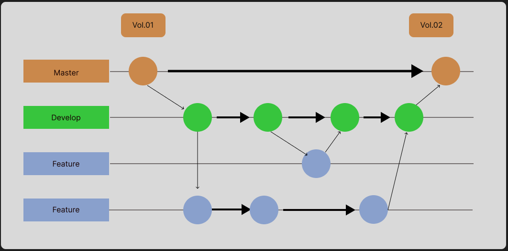
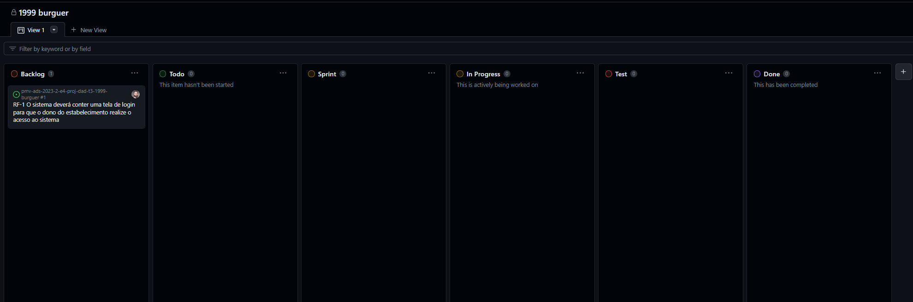

# Metodologia

Algumas plataformas estão sendo utilizadas para o desenvolvimento do projeto, seja no âmbito de produção documental, imagética ou de controle de código. 
## Relação de Ambientes de Trabalho
|  |  |  |
| :---         |     :---:      |          ---: |
| Repositório de código fonte | GitHub     |https://github.com/ICEI-PUC-Minas-PMV-ADS/pmv-ads-2023-2-e4-proj-dad-t3-1999-burguer    |
| Documentos do projeto     | Google Docs       |https://github.com/ICEI-PUC-Minas-PMV-ADS/pmv-ads-2023-2-e4-proj-dad-t3-1999-burguer/tree/main/docs      |
| Projetos de interface e Wireframes     | Figma       | https://www.figma.com/     |
| Gerenciamento do Projeto     | GitHub Projects       |https://github.com/ICEI-PUC-Minas-PMV-ADS/pmv-ads-2023-2-e4-proj-dad-t3-1999-burguer/projects?query=is%3Aopen      |
| Controle de versão | GIT| https://git-scm.com/
| Hospedagem para web/ api/ banco de dados |  Vercel | https://vercel.com/

## Controle de Versão

A ferramenta de controle de versão adotada no projeto foi o
[Git](https://git-scm.com/), sendo que o [Github](https://github.com)
foi utilizado para hospedagem do repositório.

O projeto segue a seguinte convenção para o nome de branches:

- `main`: versão estável já testada do software
- `develop`: versão de desenvolvimento do software
- `feature`: versão local para produzir issue

Quanto à gerência de issues, o projeto adota a seguinte convenção para
etiquetas:

- `doc`: melhorias ou acréscimos à documentação
- `bug`: uma funcionalidade encontra-se com problemas
- `enhancement`: uma funcionalidade precisa ser melhorada
- `feature`: uma nova funcionalidade precisa ser introduzida

## Gerenciamento de Projeto

### Divisão de Papéis

A equipe está organizada da seguinte maneira:
- Scrum Master: Gabriel Puddo;
- Product Owner: Guilherme Oliveira;
- Equipe de Desenvolvimento: João Victor, Carlos Marques, Guilherme Oliveira, Gabriel Puddo;
- Equipe de Design: João Victor, Carlos Marques.

### Processo

As tarefas estarão distribuídas no GitHub projects, que estará estruturado da seguinte maneira: 

- Backlog: todas as atividades que devem ser realizadas no projeto, desde a documentação até o desenvolvimento do e-commerce;
- To-do (O todo sempre tem que der a data alterada para o dia inicial daquela sprint semanal): o que está precisa ser feito e que foi definido previamente para aquela sprint. 
- In progress: O que está sendo feito durante a sprint;
- Sprint (aqui a sprint possui a data de fim, também deve ser alterada): Nessa coluna ficam os artefatos produzidos durante a sprint em questão; 
- Test: O que precisa ser testado;
- Done: Tudo o que está pronto independente da sprint. 

### Ferramentas

As ferramentas empregadas no projeto são:

- Editor de código: VSCODE
- Ferramentas de comunicação: discord
- Ferramentas de desenho de tela (_wireframing_): Figma
- Versionamento de código: Git
- Banco de dados: Postgress
- Software de administração de banco de dados: Dbeaver
- SGBD: Postgress

