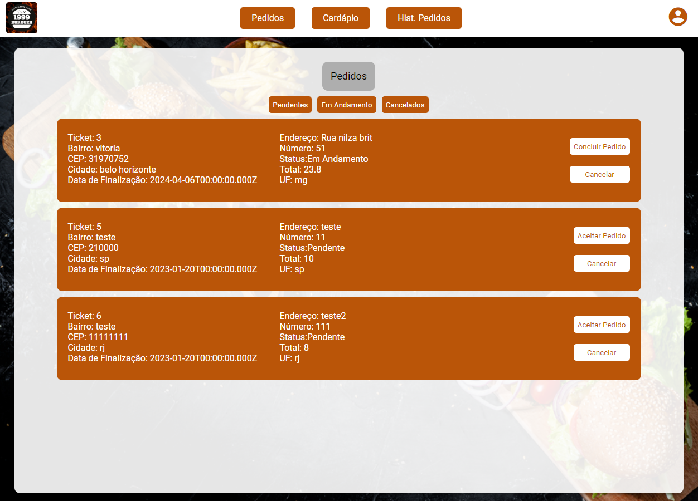
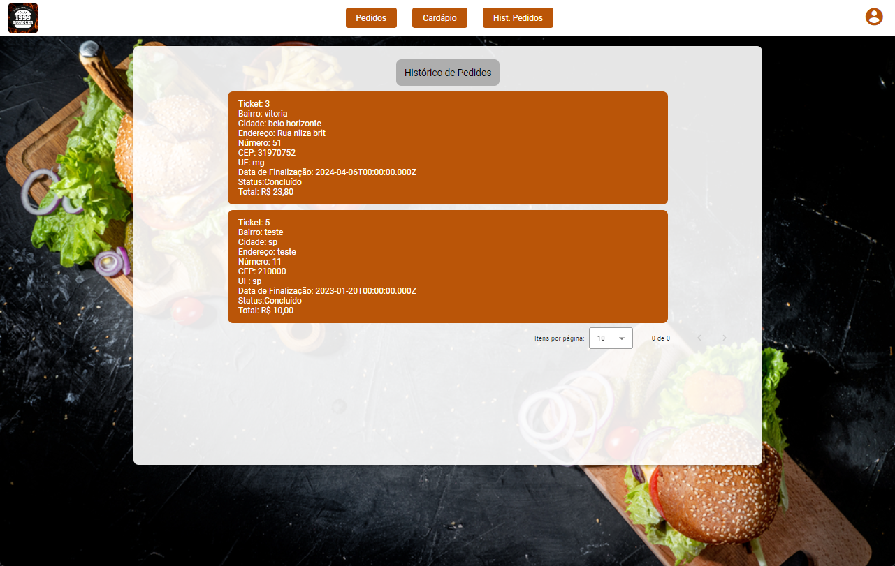
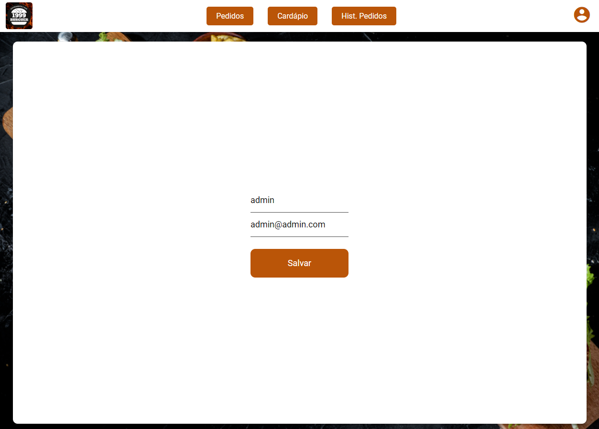

# Programação de Funcionalidades

Nesta seção serão apresentadas as telas desenvolvidas para cada uma das funcionalidades do sistema, especificadas durante ops requisitos funcionais

## Login

### Requisitos atendidos

- RF001

### Artefatos da funcionalidade

- api.service.ts
- sessao.service.ts
- login.component.ts
- login.component.scss
- login.component.html
- Pasta SCSS
- sessao.module.ts

## Home de Pedidos

### Requisitos atendidos

- RF002
- RF004
- RF005
- RF006
- RF012

### Artefatos da funcionalidade

- home-pedidos.component.html
- home-pedidos.component.ts
- home-pedidos.component.scss
- Pasta SCSS
- api.service.ts
- pedidos.service.ts
- header.component.html
- header.component.scss
- header.component.ts
- Pasta layouts
- listaDePedidos.ts
- pedidos.module.ts

## Histórico de Pedidos

### Requisitos atendidos

- RF011

### Artefatos da funcionalidade

- historico-pedidos.component.html
- historico-pedidos.component.ts
- historico-pedidos.component.scss
- Pasta SCSS
- api.service.ts
- pedidos.service.ts
- header.component.html
- header.component.scss
- header.component.ts
- Pasta layouts
- listaDePedidos.ts
- pedidos.module.ts

## Edição de usuário

### Requisitos atendidos

- RF013

### Artefatos da funcionalidade

- edit-usuario.component.html
- edit-usuarios.component.ts
- edit-usuario.component.scss
- Pasta SCSS
- api.service.ts
- usuarios.service.ts
- header.component.html
- header.component.scss
- header.component.ts
- Pasta layouts
- usuario.module.ts
