# Plano de Testes de Software

Assim como nas outras partes do projeto, o plano de testes será separado por aplicação entregue durante as etapas do projeto.

## Plano de testes API

Para realizarmos os testes na API criamos uma estrutura que facilita a nossa entrega, em que há uma estrutura de testes unitários responsáveis por validar todos os endpoints, controllers e providers em um ambiente específico.

Esse ambiente foi todo configurado através do docker, assim, simulamos um ambiente de produção localmente e o deploy só ocorrerá caso os testes passem com sucesso.

Os testes estão sendo desenvolvidos utilizando o framework Jest, ótimo para realizar testes de unidade/integração em JavaScript. A estrutura do teste sempre vai ser um Describe (Switch de testes) e It (Casos de teste). Buscamos priorizar os "Caminhos felizes" e também tratamos algumas exceções que foram determinadas na criação dos controllers.

Os testes rodam num ambiente Docker, onde temos um banco de dados virtual. 

Com este setup conseguimos preparar tudo antes de realizar o deploy. Assim, os testes validam tudo que precisamos ao invés de fazer essas ações em produção.

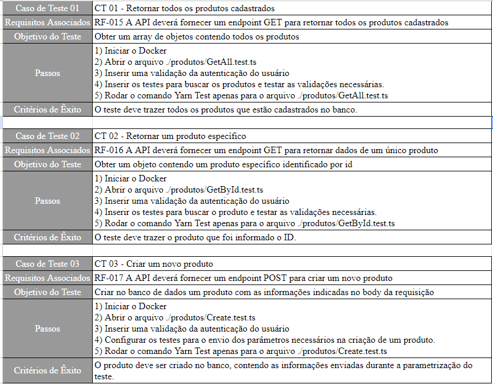
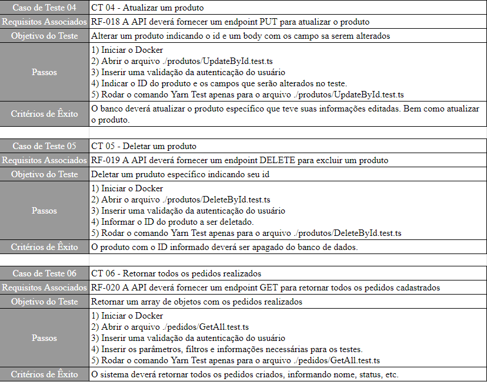
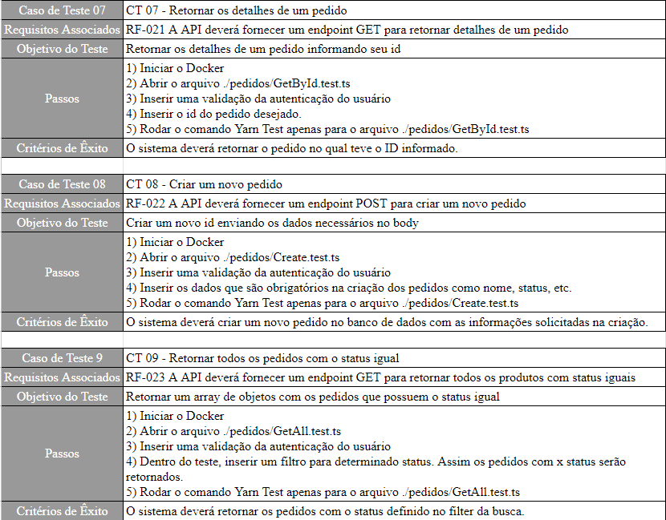
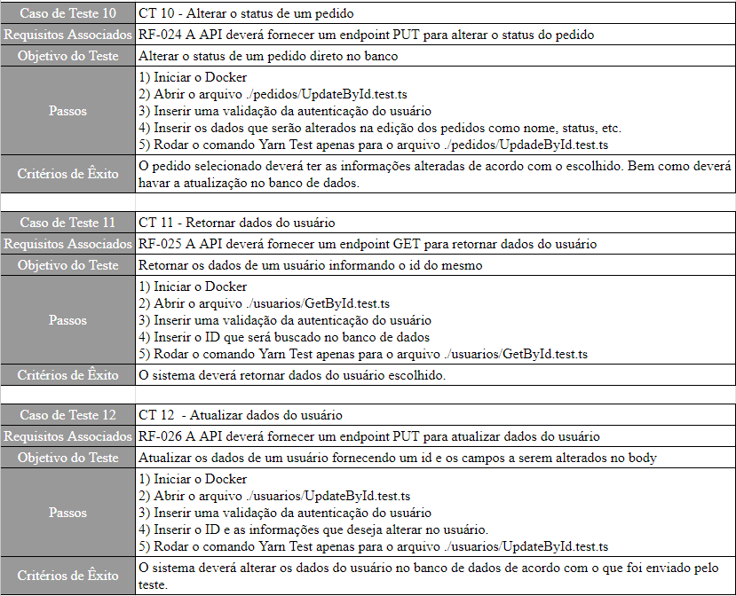
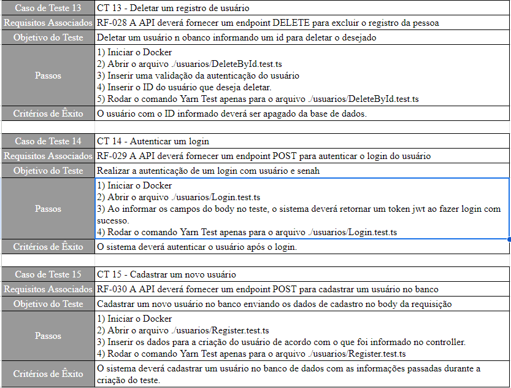

## Plano de testes FrontEnd

Os testes de FrontEnd foram testes funcionais e manuais, de forma a verificarmos a funcionalidade do que foi criado. 

O objetivo foi verificar as ações realizadas e como elas afetariam a autenticação e o banco de dados, uma vez que as telas foram montadas, na parte de exibição de dados, cadastro e etc com consulta direta na API desenvolvida.

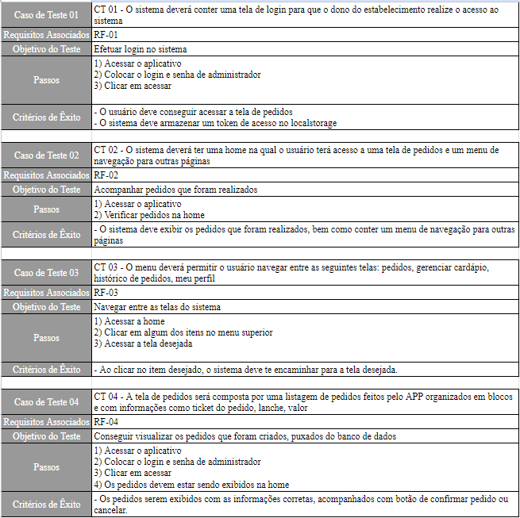
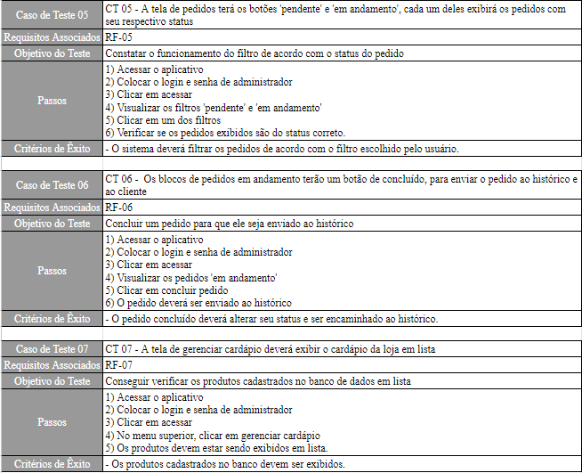
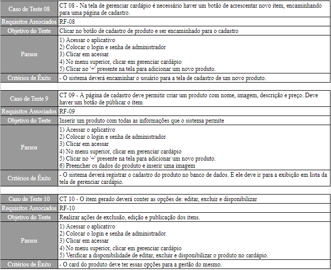
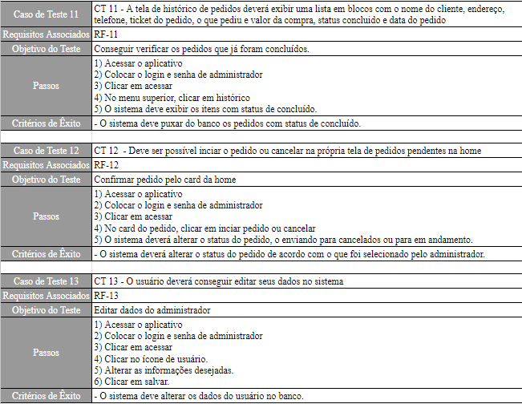
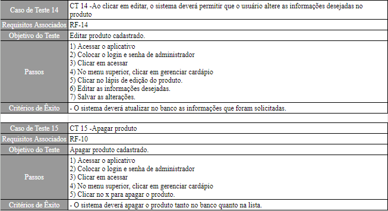
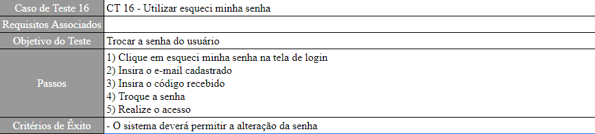