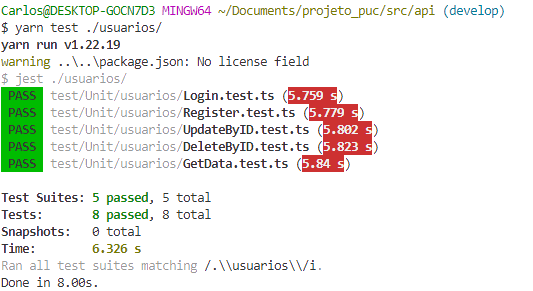
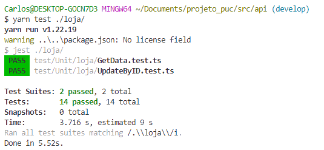
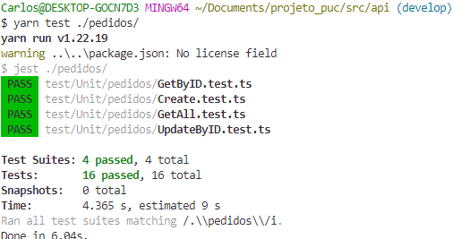
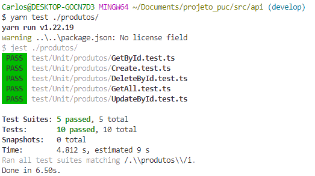
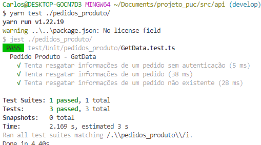

# Registro de Testes de Software

# Registros de testes da API

## Avaliação

Os testes indicaram que teremos que verificar posteriormente o acesso a rotas inexistentes. Uma vez que ao acessar uma rota inexistente o sistema não realiza o bloqueio.

Em relação as melhorias, conseguimos implementar tudo que estava proposto e os testes indicaram um resultado positivo em relação a isso.

O Framework utilizado para a realização dos testes foi o jest.

# Registros de testes de FrontEnd

| Caso de Teste 1   | CT 01 - O sistema deverá conter uma tela de login para que o dono do estabelecimento realize o acesso ao sistema do                         |
| ----------------- | ------------------------------------------------------------- |
| Objetivo do teste |Efetuar login no sistema                            |
| Resultado         | Todos os critérios de exito foram satisfeitos adequadamente. |

| Caso de Teste 2   | CT 02 - CT 02 - O sistema deverá ter uma home na qual o usuário terá acesso a uma tela de pedidos e um menu de navegação para outras páginas                        |
| ----------------- | ------------------------------------------------------------- |
| Objetivo do teste | Acompanhar pedidos que foram realizados                              |
| Resultado         | Todos os critérios de exito foram satisfeitos adequadamente. |

| Caso de Teste 3   | CT 03 - O menu deverá permitir o usuário navegar entre as seguintes telas: pedidos, gerenciar cardápio, histórico de pedidos, meu perfil                          |
| ----------------- | ------------------------------------------------------------- |
| Objetivo do teste | Navegar entre as telas do sistema                         |
| Resultado         | Todos os critérios de exito foram satisfeitos adequadamente. |

| Caso de Teste 4   | CT 04 - A tela de pedidos será composta por uma listagem de pedidos feitos pelo APP organizados em blocos e com informações como ticket do pedido, lanche, valor                        |
| ----------------- | ------------------------------------------------------------- |
| Objetivo do teste | Conseguir visualizar os pedidos que foram criados, puxados do banco de dados                        |
| Resultado         | Todos os critérios de exito foram satisfeitos adequadamente. |

| Caso de Teste 5   | CT 05 - A tela de pedidos terá os botões 'pendente' e 'em andamento', cada um deles exibirá os pedidos com seu respectivo status                                     |
| ----------------- | --------------------------------------------------------------------- |
| Objetivo do teste | Constatar o funcionamento do filtro de acordo com o status do pedido |
| Resultado         | Todos os critérios de exito foram satisfeitos adequadamente.         |

| Caso de Teste 6   | CT 06 -  Os blocos de pedidos em andamento terão um botão de concluído, para enviar o pedido ao histórico e ao cliente                                      |
| ----------------- | ---------------------------------------------------------------------- |
| Objetivo do teste | Concluir um pedido para que ele seja enviado ao histórico |
| Resultado         | Todos os critérios de exito foram satisfeitos adequadamente.          |

| Caso de Teste 7   | CT 07 - A tela de gerenciar cardápio deverá exibir o cardápio da loja em lista                                                |
| ----------------- | ------------------------------------------------------------- |
| Objetivo do teste | Conseguir verificar os produtos cadastrados no banco de dados em lista           |
| Resultado         | Todos os critérios de exito foram satisfeitos adequadamente. |

| Caso de Teste 8   | CT 08 - Na tela de gerenciar cardápio é necessário haver um botão de acrescentar novo item, encaminhando para uma página de cadastro.                                  |
| ----------------- | ------------------------------------------------------------- |
| Objetivo do teste |Clicar no botão de cadastro de produto e ser encaminhado para o cadastro         |
| Resultado         | Todos os critérios de exito foram satisfeitos adequadamente. |

| Caso de Teste 9   | CT 09 - A página de cadastro deve permitir criar um produto com nome, imagem, descrição e preço. Deve haver um botão de públicar o ítem                                    |
| ----------------- | ------------------------------------------------------------- |
| Objetivo do teste | Inserir um produto com todas as informações que o sistema permite          |
| Resultado         | Todos os critérios de exito foram satisfeitos adequadamente. |

| Caso de Teste 10  | CT 10 - O item gerado deverá conter as opções de: editar, excluir e disponibilizar                                      |
| ----------------- | ------------------------------------------------------------- |
| Objetivo do teste | Realizar ações de exclusão, edição e publicação dos itens.           |
| Resultado         | Todos os critérios de exito foram satisfeitos adequadamente. |

| Caso de Teste 11  | CT 11 - A tela de histórico de pedidos deverá exibir uma lista em blocos com o nome do cliente, endereço, telefone, ticket do pedido, o que pediu e valor da compra, status concluido e data do pedido                    |
| ----------------- | -------------------------------------------------------------- |
| Objetivo do teste | Conseguir verificar os pedidos que já foram concluídos. |
| Resultado         | Todos os critérios de exito foram satisfeitos adequadamente.  |

| Caso de Teste 12  | CT 12  - Deve ser possível inciar o pedido ou cancelar na própria tela de pedidos pendentes na home                                                      |
| ----------------- | -------------------------------------------------------------------------------- |
| Objetivo do teste | Confirmar pedido pelo card da home |
| Resultado         | Todos os critérios de exito foram satisfeitos adequadamente.                    |

| Caso de Teste 13  | CT 13 - O usuário deverá conseguir editar seus dados no sistema                       |
| ----------------- | ------------------------------------------------------------- |
| Objetivo do teste | Editar dados do administrador                                   |
| Resultado         | Todos os critérios de exito foram satisfeitos adequadamente. |

| Caso de Teste 14  | CT 14 - Ao clicar em editar, o sistema deverá permitir que o usuário altere as informações desejadas no produto                      |
| ----------------- | ------------------------------------------------------------- |
| Objetivo do teste | Editar produto cadastrado.                                   |
| Resultado         | Todos os critérios de exito foram satisfeitos adequadamente. |

| Caso de Teste 15  | CT 15 - Apagar produto                      |
| ----------------- | ------------------------------------------------------------- |
| Objetivo do teste | Apagar produto cadastrado.                                   |
| Resultado         | Todos os critérios de exito foram satisfeitos adequadamente. |

| Caso de Teste 16  | CT 16 - Esqueci minha senha                   |
| ----------------- | ------------------------------------------------------------- |
| Objetivo do teste | Conseguir alterar a senha do usuaário                                   |
| Resultado         | Todos os critérios de exito foram satisfeitos adequadamente. |

# Registros de testes Aplicação Mobile

